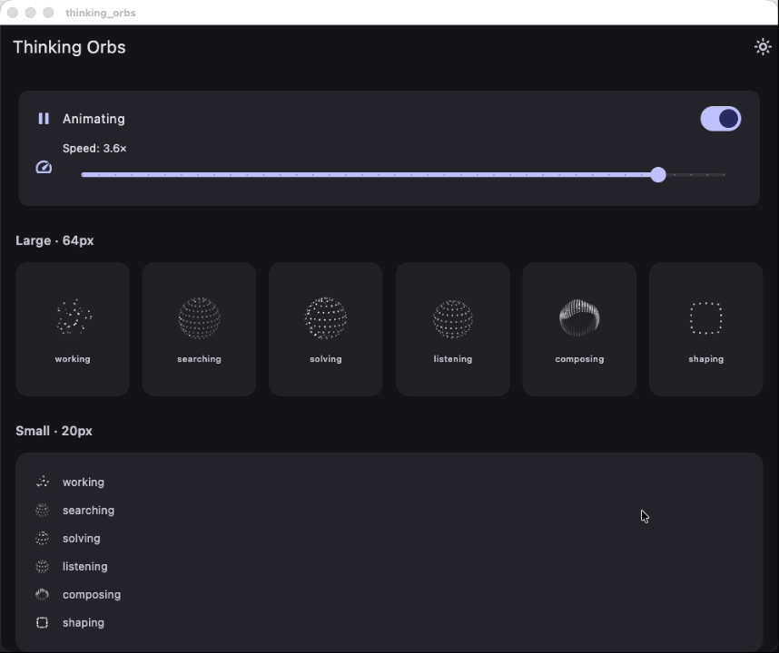

# thinking-orbs

Dotted thought-orb loading indicators for AI & agent UIs. Six hand-tuned animated states, each shipped at two purpose-tuned sizes, rendered on a plain Flutter `Canvas` - no WebGL, no filters, works identically across iOS, Android, macOS, web, and more.

A Flutter port of [thinking-orbs](https://github.com/Jakubantalik/thinking-orbs) (React + Canvas 2D), faithful to the original engine's geometry, depth shading, and per-state tuning.

[✨ Live demo (original JS version)](https://orbs.jakubantalik.com) — the Flutter animations are pixel-identical.

English | [简体中文](README.zh-CN.md)

<p align="center">
  
</p>

## Install

Add to your `pubspec.yaml`:

```yaml
dependencies:
  thinking_orbs:
    path: ../thinking-orbs-flutter
```

Or via git:

```yaml
dependencies:
  thinking_orbs:
    git:
      url: https://github.com/your-username/thinking-orbs-flutter.git
```

## Quick start

```dart
import 'package:thinking_orbs/thinking_orbs.dart';

class Status extends StatelessWidget {
  @override
  Widget build(BuildContext context) {
    return ThinkingOrb(state: OrbState.searching, size: OrbSize.large);
  }
}
```

## States

Six verbs an agent can be doing, each a distinct animation:

```dart
ThinkingOrb(state: OrbState.working)     // particles on tilted orbits
ThinkingOrb(state: OrbState.searching)   // a scan meridian sweeps a dotted globe
ThinkingOrb(state: OrbState.solving)     // bands scramble, then click back solved
ThinkingOrb(state: OrbState.listening)   // a waveform rolls through the rings
ThinkingOrb(state: OrbState.composing)   // an undulating multi-band sash
ThinkingOrb(state: OrbState.shaping)     // dotted outline: circle -> triangle -> square
```

## Sizes

Two tuned presets - separate designs, not a scale factor. `OrbSize.large` (64px) for chat-avatar scale, `OrbSize.small` (20px) for inline-text scale. Each carries its own dot count, dot size and speed tuning:

```dart
ThinkingOrb(state: OrbState.working, size: OrbSize.large)
ThinkingOrb(state: OrbState.working, size: OrbSize.small)
```

## Theme

Strictly monochrome - light ink for dark backgrounds, dark ink for light backgrounds - with the mode picked automatically from the ambient `ThemeData`:

```dart
ThinkingOrb(theme: OrbTheme.auto)   // default - detects from ThemeData.brightness
ThinkingOrb(theme: OrbTheme.dark)   // pin: light dots for dark backgrounds
ThinkingOrb(theme: OrbTheme.light)  // pin: dark dots for light backgrounds
```

`auto` resolves from `Theme.of(context).brightness` and updates live when the app theme changes (e.g. toggling between light and dark mode at runtime).

## Other props

```dart
ThinkingOrb(
  state: OrbState.solving,
  size: OrbSize.small,
  speed: 1.5,                 // multiplier on the preset's baked speed
  paused: false,              // freeze on the current frame
  semanticsLabel: 'Analysing repository…',  // overrides the per-state default
)
```

## Accessibility & performance

- `Semantics(image: true)` with a sensible per-state label out of the box (e.g. "Searching…", "Working…").
- `MediaQuery.disableAnimations` renders a static representative frame - no animation - and still follows the live theme.
- Every instance pauses automatically when the app is backgrounded (`WidgetsBindingObserver` / `AppLifecycleState`) or when `paused` is true, and resumes in phase via accumulated ticker time.
- Plain `Canvas.drawCircle` arcs only: no filters, no shaders, no offscreen layers - the same pixels everywhere, cheap on low-end devices. A single `Paint` object is reused across all dots per frame to minimize allocations.

## Power-user API

For consumers driving their own canvas outside the widget:

```dart
import 'package:thinking_orbs/thinking_orbs.dart';

final resolved = resolvePreset(OrbState.searching, OrbSize.large);
final draw = modeDraws[resolved.mode]!;

// In your CustomPainter.paint():
draw(canvas, 64, elapsedTime * resolved.speed, isDark, resolved.opts);
```

| Export | Description |
|---|---|
| `ThinkingOrb` | The main widget. |
| `OrbState` | Six-state enum. |
| `OrbSize` | Two-size enum (`large` 64px / `small` 20px). |
| `OrbTheme` | Theme enum (`auto` / `dark` / `light`). |
| `OrbPainter` | The `CustomPainter` (for advanced composition). |
| `resolvePreset(state, size)` | Resolves a (state, size) pair to mode + speed + scaled opts. |
| `stateToMode` | Maps `OrbState` → internal mode key. |
| `modeDraws` | Maps mode key → frame draw function. |

## Demo

Run the included demo app to see all six states at both sizes with live theme/pause/speed controls:

```bash
flutter run
```

## License

MIT © Jakub Antalik (original library). Flutter port under the same license.
